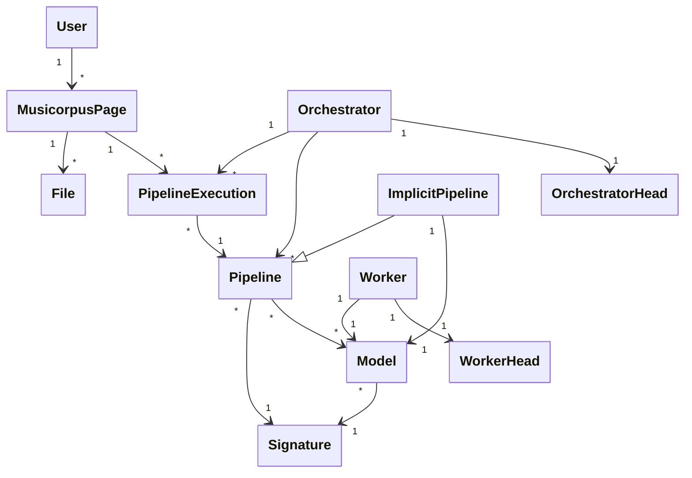

# Domain model

The domain model of Musibot is the following:

**User** is the person/entity who is accessing Musibot via its API. It uploads input files into an empty *MusicorpusPage*, then runs *Pipelines*, and finally downloads the new generated data from that *MusicorpusPage*.

**MusicorpusPage** is all the data associated with a single scanned page (or a part of it), following the [Musicorpus Specification](https://github.com/OmniOMR/musicorpus/blob/main/docs/musicorpus-specification/musicorpus-specification.md). It starts out containing only the scan of the page as a JPEG file and then a recognition *Pipeline* is executed to provide additional data. Finally, the *User* downloads this additional data after the *PipelineExecution* finishes.

**File** is what a *MusicorpusPage* consists of. The page is just an empty directory and it contains *Files* with names and meaning governed by the [Musicorpus Specification](https://github.com/OmniOMR/musicorpus/blob/main/docs/musicorpus-specification/musicorpus-specification.md).

**PipelineExecution** is one execution of some *Pipeline* against some *Files* in a *MusicorpusPage*. The execution generates new *Files* that are added to the *MusicorpusPage*.

**Pipeline** is a specific sequence of operations and *Model* invocations that produces some new data (e.g. MusicXML or COCO page layout boxes) from some existing input data (page JPEG scan). A *Pipeline* is represented in code by an `async` python function and is held only in memory when executing (*PipelineExecution*) for up to a few minutes. A *Pipeline* is identified by a name and a version.

**Orchestrator** is a service that provides *Pipeline* implementations and handles their execution. By executing a *Pipeline* it orchestrates the runtime of individual *Models*. There may be multiple *Orchestrators*, each having different set of pipelines, and even multiple running instances of the *Orchestrator* to provide horizontal scalability. *Orchestrators* may live outside of this repository, but this repository provides some out of the box.

**OrchestratorHead** is a small, operating system process that runs one specific *Orchestrator* (within the same process). It serves as the interface layer between the Musibot software system and custom *Pipeline* implementations of that *Orchestrator*. Each *Orchestrator* runs exactly one *OrchestratorHead* (it is the same process). While *Orchestrator* refers to the whole process and its *Pipelines*, *OrchestratorHead* refers explicitly only to the Musibot-interface part.

**Model** is a specific OMR model (in a specific version) used by pipelines to perform recognition work (i.e. transcribing a single staff of music to MusicXML). Models may live outside of this repository, but this repository provides some out of the box. Where model's weights are stored depends on the model, it may be using Github releases, Hugging face or have parameters commited in the repository. A *Model* is identified by a name and a version.

**WorkerHead** is a small, separate operating system process that runs one specific *Model* as a child subprocess, communicating with it over a dedicated pair of pipes and the filesystem. This lets the *Model* keep its own python version and dependencies and stay unaware of Musibot's messaging and storage. Each *Worker head* runs exactly one *Model*.

**Worker** is a running pairing of one *Worker head* with the one *Model* it serves, deployed somewhere (on some machine). It is the unit that Musibot scales horizontally — to absorb load bursts, more *Workers* are started for a given *Model*. A *Worker* is deliberately not conflated with its *Worker head*: the head is merely the process that drives the model, whereas the *Worker* is the whole running deployment (head plus model) and is the more important concept.

**ImplicitPipeline** models and pipelines have the same interface - they modify a *MusicorpusPage*. The semantic difference is that a *User* sees a *Pipeline*, but is unaware of any *Models*. To make *Models* testable without having to write *Pipelines* that simply call that *Model*, Musibot creates an *ImplicitPipeline* for each *Model* it knows about. *User* can than invoke that *ImplicitPipeline* in order to execute (and use/test) just that single *Model* in isolation. The *ImplicitPipeline* has the same name and version as the *Model* behind it. For this reason, *Model* names should not conflict with *Pipeline* names. *ImplicitPipelines* are orchestrated by the *Web API* service, which means that they allow the Musibot system to function without *Orchestrators*. *Orchestrators* are only needed when more complex pipelines need to be introduced.

**Signature** is the I/O signature of a *Pipeline* or a *Model*. It specifies the set of *Files* it expects to have as an input and the set of *Files* it will produce as output.

## FAQ

**Why have *Models* when we already have *Pipelines*?** 
Pipelines have the limitation of being coupled to Musibot python code too tightly. This means you cannot execute a model requiring an old python version inside a pipeline. It also means you cannot combine two models with conflicting dependencies within one pipeline. Additionally, decoupling models lets them access custom hardware (e.g. specific GPU versions), scale independently, and batch together requests from different *Pipeline Executions*.

**Why have multiple *Orchestrators* when one might do?** 
It comes down to extensibility. The Musibot software system does not depend on a specific set of *Pipelines* and *Models*. To make the software system extensible in other ways, than rewriting code in this repo (e.g. third-parties may have their own repo and use this one as a dependency only) we make *Orchestrators* (and *Models* alike) pluggable-in at runtime, just by connecting to the RabbitMQ message broker. The developer may choose to plug-in an in-development *Orchestrator* running on his/her laptop into a running system and test how it behaves "in production". Without this flexibility, one would have to do a full Musibot release process and deploy the updated Musibot system with the new *Orchestrator* logic, just to perform this simple test, which increases the cost of one iteration. Second, orthogonal reason, for having multiple *Orchestrators* is their horizontal scalability - but that concerns having multiple running instances of the same *Orchestrator*.

**Why identify *Models* and *Pipelines* by name+version instead of their *Signature*?** 
Imagine two deep learning models for end-to-end staff recognition (image to MusicXML). Surely they have the same *Signature*. But one is much newer than the other. Or one is trained on B/W images, while the other one on handwritten. Surely they are not the same qualitatively and a *User* must have a way to choose between them. Therefore *Signature* does not suffice to identify a pipeline (or model).
