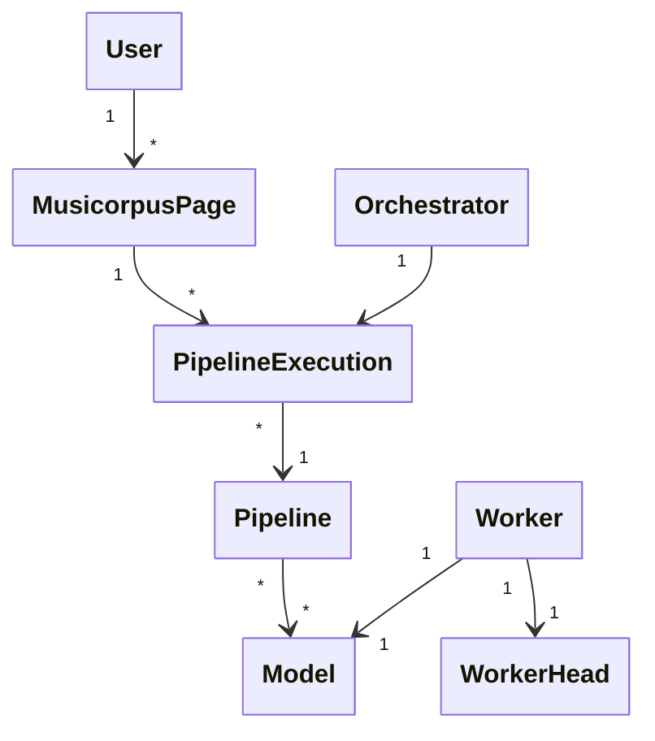

# Domain model

The domain model of Musibot is the following:

**User** is the person/entity who is accessing Musibot via its API.

**MusicorpusPage** is all the data associated with a single scanned page (or a part of it), following the [Musicorpus Specification](https://github.com/OmniOMR/musicorpus/blob/main/docs/musicorpus-specification/musicorpus-specification.md). It starts out containing only the scan of the page as a JPEG file and then a recognition *Pipeline* is executed to provide additional data. Finally, the *User* downloads this additional data after the *PipelineExecution* finishes.

**PipelineExecution** is one execution of some *Pipeline* against some data in the form of a *MusicorpusPage*. The execution generates new data that is added to the *MusicorpusPage*.

**Pipeline** is a specific sequence of operations and *Model* invocations that produces some new data (e.g. MusicXML or COCO page layout boxes) from some existing input data (page JPEG scan). A *Pipeline* is represented in code by an `async` python function and is held only in memory when executing (*PipelineExecution*) for up to a few minutes.

**Orchestrator** is the part of the python codebase (which may or may not be a separate service/services) responsible for executing *Pipelines*. By executing a *Pipeline* it orchestrates the runtime of individual *Models*.

**Model** is a specific OMR model (in a specific version) used by pipelines to perform recognition work (i.e. transcribing a single staff of music to MusicXML). Most models live in their own repositories and are pip-installable, and each model's repository also owns its weights (GitHub releases, Hugging Face, or baked in).

**Worker head** is a small, separate operating system process that runs one specific *Model* as a child subprocess, communicating with it over standard input and the filesystem. This lets the *Model* keep its own python version and dependencies and stay unaware of Musibot's messaging and storage. Each *Worker head* runs exactly one *Model*.

**Worker** is a running pairing of one *Worker head* with the one *Model* it serves, deployed somewhere (on some machine). It is the unit that Musibot scales horizontally — to absorb load bursts, more *Workers* are started for a given *Model*. A *Worker* is deliberately not conflated with its *Worker head*: the head is merely the process that drives the model, whereas the *Worker* is the whole running deployment (head plus model) and is the more important concept.
